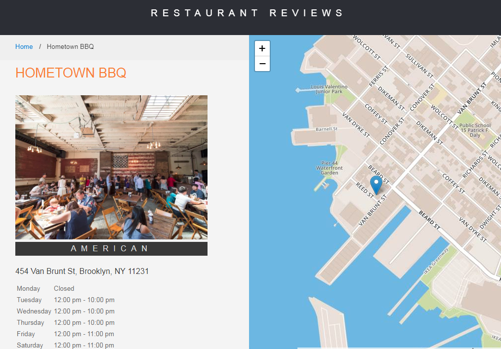

# Mobile Web Specialist Certification Course
#### _Three Stage Course Material Project - Restaurant Reviews_

## Project Overview: Stage 1

For this **Restaurant Reviews** projects, I incrementally converted a static webpage to a mobile-ready web application. I took a [static design](https://github.com/udacity/mws-restaurant-stage-1) that lacked accessibility and converted the design to be _**responsive**_ on different sized displays and _**accessible**_ for screen reader use. I also added a **service worker** to begin the process of creating a seamless _**offline experience**_ for my users.

### How to Install the App

1. Download zip or clone
2. In a terminal, check the version of Python you have: `python -V`. If you have Python 2.x, spin up the server with `python -m SimpleHTTPServer 8000` (or some other port, if port 8000 is already in use.) For Python 3.x, you can use `py -m http.server 8000`. If you don't have Python installed, navigate to Python's [website](https://www.python.org/) to download and install the software.
3. With your server running, visit the site: `http://localhost:8000`

Desktop:

===============================

Mobile:

===============================

